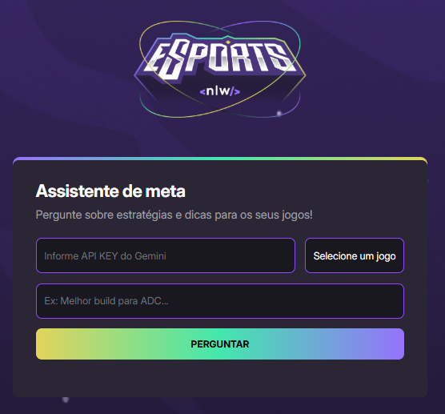
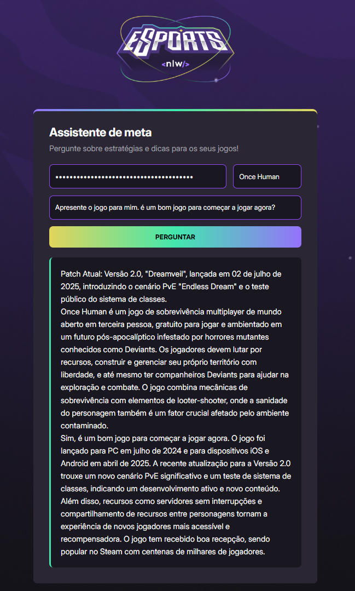

# 🎮 GameCoach AI

Coach inteligente para jogos que utiliza a API do Google Gemini para fornecer dicas, estratégias e suporte personalizado aos jogadores.

## 🚀 Sobre o Projeto

Este projeto foi desenvolvido durante o **NLW Agents** da Rocketseat e tem como objetivo criar um assistente de IA especializado em jogos. O usuário pode selecionar seu jogo favorito e fazer perguntas específicas para receber orientações personalizadas.

## ⚡ Funcionalidades

- ✅ Integração com Google Gemini API
- ✅ Suporte a múltiplos jogos
- ✅ Interface intuitiva e responsiva
- ✅ Coaching personalizado em tempo real

## 🛠️ Tecnologias

- HTML5
- CSS3
- JavaScript (ES6+)
- Google Gemini API
- Fetch API

Quer conhecer mais sobre minha experiência desenvolvendo este projeto? 
Confira meu [diário de aprendizado](DEV_JOURNEY.md) onde documento 
cada etapa do desenvolvimento durante o NLW Agents.

## 🎯 Como usar

1. Clone este repositório
   ```bash
   git clone https://github.com/ChristianBeninca/NLW20-GameCoachAi.git
   ```

2. Obtenha sua chave da API do Google Gemini
   - Acesse [Google AI Studio](https://makersuite.google.com/app/apikey)
   - Crie uma nova chave de API
   - Guarde a chave com segurança

3. Abra o projeto em um servidor local
   ```bash
   # Usando Python
   python -m http.server 8000
   
   # Ou usando Node.js
   npx serve .
   ```

4. Acesse `http://localhost:8000` no seu navegador

5. Insira sua API key, selecione o jogo e faça suas perguntas!

## 🎮 Jogos Suportados

- League of Legends
- Valorant
- Counter-Strike: Global Offensive 2
- World of Warcraft
- Once Human

## 📸 Screenshots

<div align="center">
  
  <br>
  
</div>

## 🤝 Contribuindo

Contribuições são sempre bem-vindas! Sinta-se à vontade para:

1. Fazer fork do projeto
2. Criar uma branch para sua feature (`git checkout -b feature/AmazingFeature`)
3. Commit suas mudanças (`git commit -m 'Add some AmazingFeature'`)
4. Push para a branch (`git push origin feature/AmazingFeature`)
5. Abrir um Pull Request

## 📝 Licença

Este projeto está sob a licença MIT. Veja o arquivo [LICENSE](LICENSE) para mais detalhes.

## 🎓 Aprendizado

Este projeto foi uma excelente oportunidade para aprender sobre:
- Integração com APIs de IA
- Manipulação do DOM
- Promises e async/await
- Tratamento de erros
- CORS e requisições HTTP

## 🙏 Agradecimentos

- [Rocketseat](https://rocketseat.com.br) pelo NLW Agents
- [Google](https://ai.google.dev/) pela API Gemini
- Comunidade dev por todo o suporte

---

Desenvolvido com 💜 durante o NLW Agents da Rocketseat

---

<div align="center">
  <div style="display: flex; gap: 1rem; justify-content: center; flex-wrap: wrap; margin: 2rem 0;">
    
<div style="
    background-image: linear-gradient(90deg, #9572FC, #43E7AD, #E2D45C);
    border-radius: 0.625rem;
    padding: 4px;
    display: inline-block;
  ">
    <div style="
      padding: 1rem 2rem;
      border-radius: 0.5rem;
      background-color: #2A2634;
    ">
      <a href="QUICK_NOTES.md" style="
        color: white;
        text-decoration: none;
        font-family: 'Inter', sans-serif;
        font-weight: 500;
      ">📚 Minhas Anotações durante as Aulas</a>
    </div>
  </div>

<div style="
    background-image: linear-gradient(90deg, #9572FC, #43E7AD, #E2D45C);
    border-radius: 0.625rem;
    padding: 4px;
    display: inline-block;
  ">
    <div style="
      padding: 1rem 2rem;
      border-radius: 0.5rem;
      background-color: #2A2634;
    ">
      <a href="DEV_JOURNEY.md" style="
        color: white;
        text-decoration: none;
        font-family: 'Inter', sans-serif;
        font-weight: 500;
      ">🛠️ Minha Jornada de Desenvolvimento</a>
    </div>
  </div>  
</div>